# Unlearn Baselines

Here is presented the unlearning problem for classification, together with a set of well-known methods commonly used in unlearning researches.

*In classification problems, unlearning is any method that allows a model $\theta$, trained on $D$ containing all seen labels $y_s \in S$, to forget a subset $D_f \subset D$ containing labels $y_f \in F \subset S$, returning as a result an unlearned model $\theta_u$ that behaves as it never saw $D_f$ during its training*.

Given that definition, it is clear that the ideal scenario is a model retrained from scratch on the retain set only ($D_r \subset D$), referred as the *golden method*. For this reason, as metrics it has also been included the Jensen Shannon Divergence between the unlearned model's probability space and the one retrained from scratch.

To obtain valid reference models, the *golden method*, as well as the other unlearning approaches have been applied and evaluated over the three forget sets presented below:

- **lforget**(low-forget): a set containing a minimal number of randomly extracted labels, taken from the union of the $vunseen_i.txt$ by using numpy.random.choice. It consists of 10, 5, 3 labels for CUB, AwA2, and aPY respectively.

- **hforget**(high-forget): a set containing an higher amount of randomly extracted labels, following the same approach of lforget, consisting of 30, 12, 7 labels for CUB, AwA2, and aPY respectively.

- **bforget**(base-forget): a set containing a median value (between lforget and hforget) of randomly extracted labels, thus composed of 20, 8, 5 labels for CUB, AwA2, and aPY respectively, extracted by following the same approach of hforget and lforget.

To obtain these forget sets, the [create_forget_set.py script](../../../scripts/data_preparation/create_forget_set.py) has been used in the following configurations:
```sh
# low-forget
python ./scripts/data_preparation/create_forget_set.py -d cub awa2 apy -nf 10 5 3 -n lforget -u tunseen --from vunseen1 vunseen2 vunseen3

# high-forget
python ./scripts/data_preparation/create_forget_set.py -d cub awa2 apy -nf 30 12 7 -n hforget -u tunseen --from vunseen1 vunseen2 vunseen3

# base-forget  -  also chosen as default forget set for configuration files
python ./scripts/data_preparation/create_forget_set.py -d cub awa2 apy -nf 20 8 5 -n bforget -u tunseen --from vunseen1 vunseen2 vunseen3
```

The chosen methods have been evaluated over the following metrics to have a complete overview of each one's performances:
- **Accuracy on $D_r$**: an effective unlearning method must delete the influence of forget set without harming the knowledge over the retain set, so this metric needs to be as high as possible considering that usually a retrained from scratch model will be more specialized on the retain set.
- **Accuracy on $D_f$**: As it is the accuracy on the forget set, it needs to be as low as possible as we don't want the model to be able to recognize anymore the forget set.
- **AUS**: This metric is an adaptive score that considers the gain between origin's retain accuracy and unlearned model's one, over the forget accuracy of the unlearned model only. Also this one needs to be as high as possible as usually with less labels, the retrained model tends to be more accurate.
- **Jensen-Shannon Divergence**: It is a symmetric metric that measures how similar two probability distributions are. It is used to compare the probability space predicted by the unlearned model with the retrained from scratch one. As it is a distance between probability distributions it needs to be as close as possible to the golden model, hence needs to be as close to 0 as possible.
- **MIA**: Since most of the unlearning problems are related with privacy topics, this metric measures how easy it is to infere membership of data to the training set. In a correctly unlearned model, it shouldn't be impossible for a binary classifier to distinguish between training samples and test samples belonging to the forget set, so it should be impossible to infere forget samples membership to the training set and thus protect the privacy of those data, for this reason this metric needs to be as close as possible to 0.5. In this work, three different approaches are followed:
- - *fMIA*: uses features to try to infere membership of training forget samples
- - *pMIA*: uses predicted logits of the unlearned model to try to infere membership of training forget samples
- - *lMIA*: it is the most common approach as it uses the difference in losses, as also reported in [SCRUB's paper](https://arxiv.org/abs/2302.09880). It tries to predict membership by comparing training samples and test samples losses as usually those tends to behave differently.

### [Retraining from scratch](../../../src/implementations/unlearn/retrain.py)

As stated in the unlearning definition for classification problems, the model has to behave as it never saw $D_f$ during training. For that reason, the forget sets discussed previously were extracted from the [proposed validation splits](https://arxiv.org/abs/1707.00600), so that the golden model's retraining doesn't contain any overlapping with the original ImageNet1K pre-training dataset.

The retraining has been executed using the same "base" split to avoid incoherences between the origin and the retrained model, using the hyperparameters in the [respective configuration file](../../../config/experiment/method/retrain.yaml)

Following, a table resuming the results obtained on each dataset, logged in Weights & Biases obtained by running the command:
```sh
python ./main.py -m experiment=unlearn experiment/method=retrain experiment/dataset=cub,awa2,apy experiment.method.forget=lforget,bforget,hforget
```

#### CUB

<div style="display:flex; justify-content:center; align-items:center">

**Forget Set**|**Accuracy on $D_r$**|**Accuracy on $D_f$**|**AUS**|**fMIA**|**pMIA**|**lMIA**|**Run-Time**
:---:|:---:|:---:|:---:|:---:|:---:|:---:|:---:
lforget|0.74399|0.00|1.02459|0.53846|0.44231|0.44231|32m 46s
bforget|0.75964|0.00|1.03133|0.50577|0.49038|0.49808|25m 29s
hforget|0.74575|0.00|1.01830|0.50897|0.46282|0.53974|41m 28s

</div>

---

#### AwA2

<div style="display:flex; justify-content:center; align-items:center">

**Forget Set**|**Accuracy on $D_r$**|**Accuracy on $D_f$**|**AUS**|**fMIA**|**pMIA**|**lMIA**|**Run-Time**
:---:|:---:|:---:|:---:|:---:|:---:|:---:|:---:
lforget|0.93107|0.00|1.00402|0.46714|0.49429|0.51214|37m 06s
bforget|0.94091|0.00|1.01576|0.50000|0.50455|0.52273|25m 38s
hforget|0.93936|0.00|1.01746|0.49389|0.49694|0.51556|24m 25s

</div>

---

#### aPY

<div style="display:flex; justify-content:center; align-items:center">

**Forget Set**|**Accuracy on $D_r$**|**Accuracy on $D_f$**|**AUS**|**fMIA**|**pMIA**|**lMIA**|**Run-Time**
:---:|:---:|:---:|:---:|:---:|:---:|:---:|:---:
lforget|0.93130|0.00|1.02609|0.44507|0.50423|0.49437|8m 42s
bforget|0.92278|0.00|1.01811|0.50769|0.48681|0.52088|11m 40s
hforget|0.91309|0.00|1.02098|0.46436|0.50000|0.49109|9m 29s

</div>

### [Finetune](../../../src/implementations/unlearn/finetune.py)

In classical fine-tuning, a model is trained over a completely unseen data distribution for a lower amount of epochs to transfer the model's learning to the new dataset. In unlearning the approach is slightly different: the origin model is taken and finetuned on the retain set only with an hyperparametrization aimed at also degrading the knowledge over the forget set, while specializing on the retain set. For this reason the hyperparameters chosen are the ones specified in the [method's specific configuration file](../../../config/experiment/method/finetune.yaml), and the validation process uses an early stopping condition based on the difference between retain and forget accuracies. This validation process has been also applied to all other methods as a common unlearning validation as it leads to easier studies of the hyperparameters and the unlearning process of each method.
To run the finetune experiment the following command has been executed which led to the results in the table below:
```sh
python ./main.py -m experiment=unlearn experiment/method=finetune experiment/dataset=cub,awa2,apy experiment.method.forget=lforget,bforget,hforget
```
#### CUB

<div style="display:flex; justify-content:center; align-items:center">

**Forget Set**|**Accuracy on $D_r$**|**Accuracy on $D_f$**|**AUS**|**JSD**|**fMIA**|**pMIA**|**lMIA**|**Run-Time**
:---:|:---:|:---:|:---:|:---:|:---:|:---:|:---:|:---:
lforget|0.73896|0.00|1.01956|0.12061|0.64615|0.64231|0.78846|9m 16s
bforget|0.75000|0.00|1.02169|0.12693|0.67500|0.66731|0.82308|6m 50s
hforget|0.77451|0.00|0.04706|0.11993|0.54744|0.50128|0.77051|13m 45s

</div>

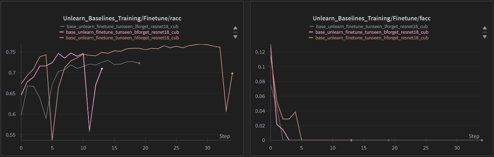

---

#### AwA2

<div style="display:flex; justify-content:center; align-items:center">

**Forget Set**|**Accuracy on $D_r$**|**Accuracy on $D_f$**|**AUS**|**JSD**|**fMIA**|**pMIA**|**lMIA**|**Run-Time**
:---:|:---:|:---:|:---:|:---:|:---:|:---:|:---:|:---:
lforget|0.89814|0.00|0.97109|0.05318|0.46357|0.46571|0.53071|16m 20s
bforget|0.91748|0.00|0.99233|0.05506|0.50273|0.53545|0.54455|17m 34s
hforget|0.91729|0.00|0.99539|0.06887|0.51194|0.50278|0.55639|13m 50s

</div>

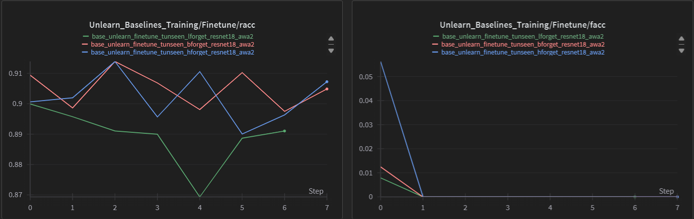

---

#### aPY

<div style="display:flex; justify-content:center; align-items:center">

**Forget Set**|**Accuracy on $D_r$**|**Accuracy on $D_f$**|**AUS**|**JSD**|**fMIA**|**pMIA**|**lMIA**|**Run-Time**
:---:|:---:|:---:|:---:|:---:|:---:|:---:|:---:|:---:
lforget|0.91391|0.00284|1.00584|0.06536|0.56056|0.60986|0.57887|5m 15s
bforget|0.91420|0.00000|1.00953|0.07332|0.51099|0.53956|0.59231|6m 04s
hforget|0.90410|0.00000|1.01199|0.07586|0.51089|0.48020|0.50891|7m 14s

</div>

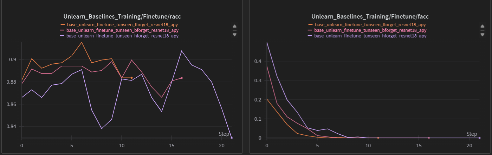

### [NegGradPlus](../../../src/implementations/unlearn/neggradplus.py)

As NegGrad has the tendency to degrade the retain knowledge, because of the unlearning process increasing the loss function unboundedly, NegGrad+ uses the minimization of the cross entropy over the retain set simultaneously to the classic NegGrad unlearning process to correct the degrading factor. To that purpose also a reduction to the cross-entropy maximization has been introduced, as NegGrad unlearning works well with lower learning rates, while finetuning showed better results with ranges around 1e-4.
The chosen hyperparameters and the maximization reduction can be checked on the [method's specific configuration file](../../../config/experiment/method/neggradplus.yaml).
```sh
python ./main -m experiment=unlearn experiemnt/method=neggradplus experiment/dataset=cub,awa2,apy experiment.method.forget=lforget,bforget,hforget
```

#### CUB

<div style="display:flex; justify-content:center; align-items:center">

**Forget Set**|**Accuracy on $D_r$**|**Accuracy on $D_f$**|**AUS**|**JSD**|**fMIA**|**pMIA**|**lMIA**|**Run-Time**
:---:|:---:|:---:|:---:|:---:|:---:|:---:|:---:|:---:
lforget|0.71213|0.00|0.99273|0.13133|0.66154|0.55000|0.61540|10m 25s
bforget|0.72952|0.00|1.00120|0.12891|0.62885|0.61538|0.65769|7m 36s
hforget|0.74575|0.00|1.01830|0.13032|0.56667|0.53333|0.60897|7m 32s

</div>

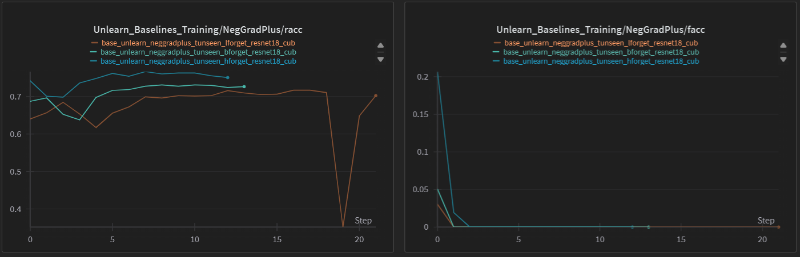

---

#### AwA2

<div style="display:flex; justify-content:center; align-items:center">

**Forget Set**|**Accuracy on $D_r$**|**Accuracy on $D_f$**|**AUS**|**JSD**|**fMIA**|**pMIA**|**lMIA**|**Run-Time**
:---:|:---:|:---:|:---:|:---:|:---:|:---:|:---:|:---:
lforget|0.90159|0.00|0.97454|0.04994|0.49000|0.49429|0.52857|21m 46s
bforget|0.91623|0.00|0.99108|0.05326|0.48909|0.50500|0.50773|19m 55s
hforget|0.93112|0.00|1.00922|0.08121|0.49556|0.50083|0.50056|35m 07s

</div>

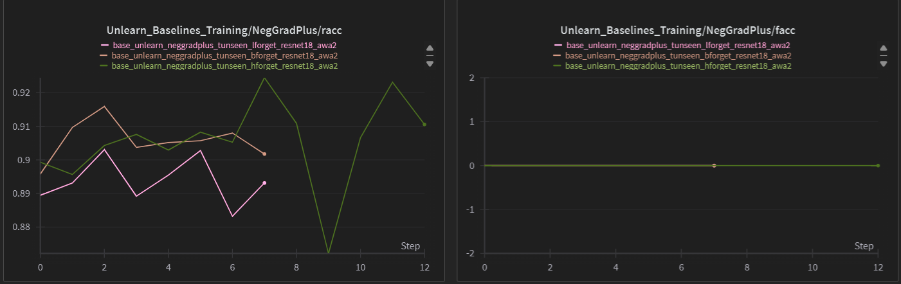

---

#### aPY

<div style="display:flex; justify-content:center; align-items:center">

**Forget Set**|**Accuracy on $D_r$**|**Accuracy on $D_f$**|**AUS**|**JSD**|**fMIA**|**pMIA**|**lMIA**|**Run-Time**
:---:|:---:|:---:|:---:|:---:|:---:|:---:|:---:|:---:
lforget|0.92609|0.00|1.02087|0.05175|0.53521|0.61690|0.59718|5m 23s
bforget|0.91706|0.00|1.01239|0.07373|0.53407|0.55385|0.51978|9m 10s
hforget|0.90210|0.00|0.00999|0.07680|0.52376|0.50891|0.46535|6m 55s

</div>

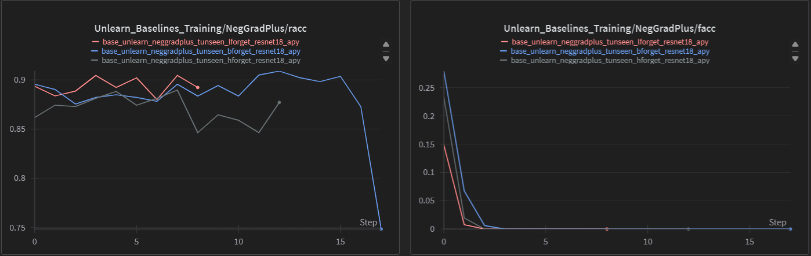

### [Bad Teacher](../../../src/implementations/unlearn/badt.py)

It is a Teacher-Student method, which exploits the origin knowledge (smart teacher) to keep the retain accuracy constant while unlearns the forget set by exploiting a randomly initialized version of the origin (bad teacher). It uses KL-Divergence to lead the unlearned model (student) towards smart teacher probability space for retain set, and towards bad teacher's one for the forget set. As shown in the results below, the retain approach used in this method also partially recovers the knowledge over forget set as it tries to approach the space probability generated on the forget labels aswell, leading to slower forgetting and worse performances. For the runs the hyperparameters in the [method's configuration file](../../../config/experiment/method/badt.yaml) have been used by running the following command:
```sh
python ./main.py -m experiment=unlearn experiemnt/method=badt experiment/dataset=cub,awa2,apy experiment.method.forget=lforget,bforget,hforget
```
As a result the following performances have been achieved:

#### CUB

<div style="display:flex; justify-content:center; align-items:center">

**Forget Set**|**Accuracy on $D_r$**|**Accuracy on $D_f$**|**AUS**|**JSD**|**fMIA**|**pMIA**|**lMIA**|**Run-Time**
:---:|:---:|:---:|:---:|:---:|:---:|:---:|:---:|:---:
lforget|0.70822|0.00000|0.98882|0.12890|0.81154|0.82308|0.76154|3m 52s
bforget|0.70723|0.00391|0.97511|0.14359|0.80358|0.80192|0.70577|4m 23s
hforget|0.69869|0.00259|0.96873|0.19023|0.77179|0.78974|0.71538|4m 39s

</div>

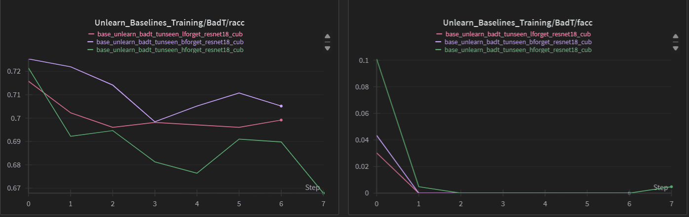

---

#### AwA2

<div style="display:flex; justify-content:center; align-items:center">

**Forget Set**|**Accuracy on $D_r$**|**Accuracy on $D_f$**|**AUS**|**JSD**|**fMIA**|**pMIA**|**lMIA**|**Run-Time**
:---:|:---:|:---:|:---:|:---:|:---:|:---:|:---:|:---:
lforget|0.92150|0.00287|0.99160|0.07891|0.53643|0.55929|0.52500|16m 15s
bforget|0.92432|0.01186|0.98746|0.09969|0.54455|0.57409|0.54864|11m 39s
hforget|0.91220|0.00557|0.98481|0.18264|0.53444|0.53306|0.51000|14m 29s

</div>

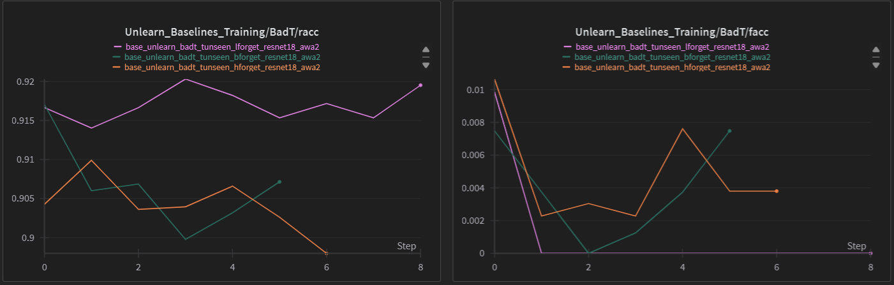

---

#### aPY

<div style="display:flex; justify-content:center; align-items:center">

**Forget Set**|**Accuracy on $D_r$**|**Accuracy on $D_f$**|**AUS**|**JSD**|**fMIA**|**pMIA**|**lMIA**|**Run-Time**
:---:|:---:|:---:|:---:|:---:|:---:|:---:|:---:|:---:
lforget|0.89565|0.00|0.99043|0.10915|0.65070|0.69014|0.61408|3m 59s
bforget|0.87989|0.00|0.97521|0.19559|0.60989|0.68901|0.57363|5m 42s
hforget|0.88811|0.00|0.99600|0.16932|0.54950|0.62871|0.49010|9m 52s

</div>

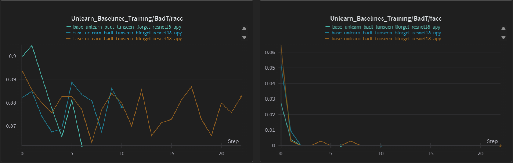

### [SCRUB](../../../src/implementations/unlearn/scrub.py)

It uses a student-teacher approach aswell as bad teacher, but instead of using a bad teacher for the forget set, it simply maximizes the kl-divergence from the teacher. It also introduces a training trick, often used when adversarial losses are involved, which consists in alternating minimization epochs where cross-entropy minimization is sided to kl-divergence minimization to enforce the retain knowledge and avoid Bad Teacher's side-effect, and maximization epochs where only kl-divergence maximization is involved. It leans to be the most robust method for unlearning among the baselines shown. With the configuration specified in the [method's configuration file](../../../config/experiment/method/scrub.yaml) and by running the following command:
```sh
python ./main -m experiment=unlearn experiemnt/method=scrub experiment/dataset=cub,awa2,apy experiment.method.forget=lforget,bforget,hforget
```
the following results have been obtained:

#### CUB

<div style="display:flex; justify-content:center; align-items:center">

**Forget Set**|**Accuracy on $D_r$**|**Accuracy on $D_f$**|**AUS**|**JSD**|**fMIA**|**pMIA**|**lMIA**|**Run-Time**
:---:|:---:|:---:|:---:|:---:|:---:|:---:|:---:|:---:
lforget|0.69871|0.00|0.97932|0.15156|0.50769|0.49615|0.58077|17m 10s
bforget|0.75482|0.00|1.02651|0.12240|0.54423|0.47308|0.55577|23m 15s
hforget|0.76209|0.00|1.03464|0.12628|0.55000|0.56410|0.56410|21m 15s

</div>

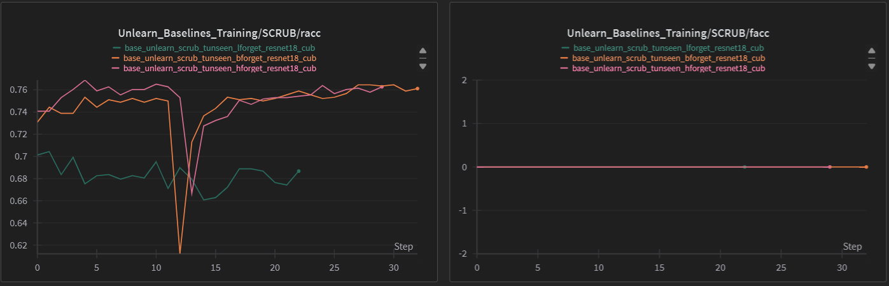

---

#### AwA2

<div style="display:flex; justify-content:center; align-items:center">

**Forget Set**|**Accuracy on $D_r$**|**Accuracy on $D_f$**|**AUS**|**JSD**|**fMIA**|**pMIA**|**lMIA**|**Run-Time**
:---:|:---:|:---:|:---:|:---:|:---:|:---:|:---:|:---:
lforget|0.91710|0.00|0.99004|0.04308|0.47000|0.51357|0.53571|21m 33s
bforget|0.92515|0.00|1.00000|0.04210|0.49682|0.52182|0.51591|22m 01s
hforget|0.91923|0.00|0.99733|0.06221|0.48167|0.49861|0.50278|18m 55s

</div>

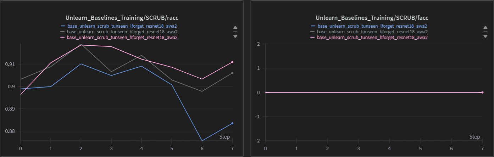

---

#### aPY

<div style="display:flex; justify-content:center; align-items:center">

**Forget Set**|**Accuracy on $D_r$**|**Accuracy on $D_f$**|**AUS**|**JSD**|**fMIA**|**pMIA**|**lMIA**|**Run-Time**
:---:|:---:|:---:|:---:|:---:|:---:|:---:|:---:|:---:
lforget|0.92522|0.00|1.02000|0.05317|0.55775|0.56761|0.53944|8m 22s
bforget|0.92278|0.00|1.01811|0.05691|0.49341|0.46593|0.51978|5m 42s
hforget|0.88811|0.00|0.99600|0.07340|0.50099|0.53960|0.56436|6m 43s

</div>

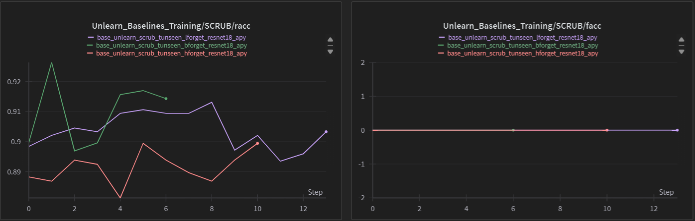