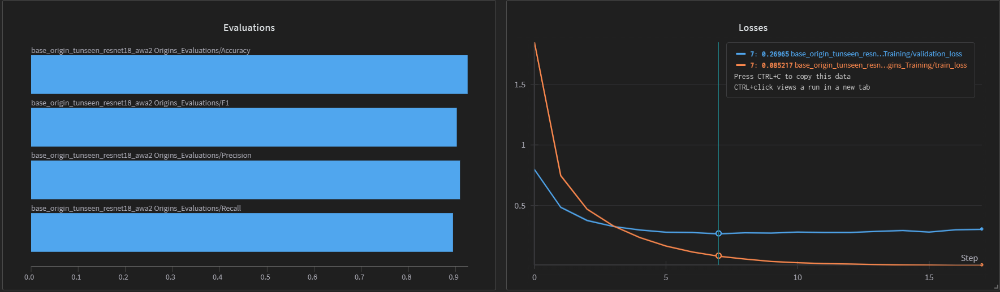
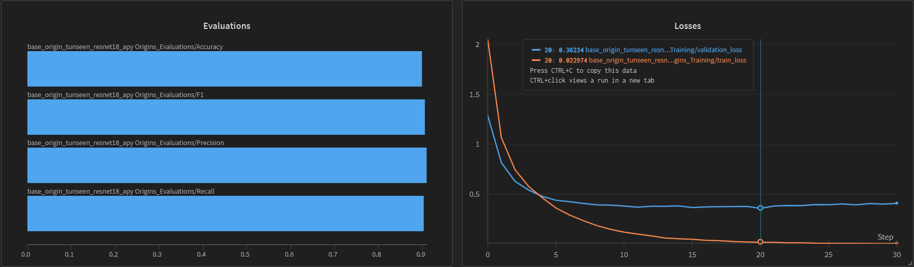
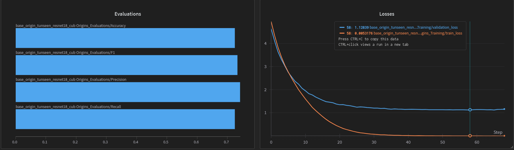
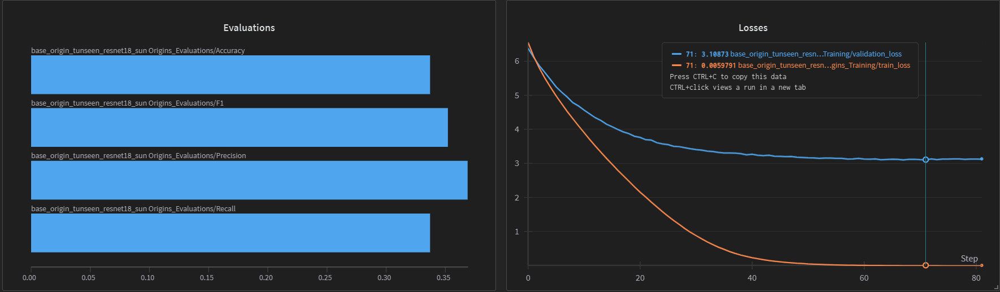

# Current Work

This section details the key implementations and the corresponding results logged using Weights & Biases (WandB). It presents the training and evaluation outcomes of a pretrained ResNet18 model on ImageNet1K, tested on the seen classes of Zero-Shot Learning benchmark datasets. The seen/unseen class splits follow the [arXiv:1707.00600](https://arxiv.org/abs/1707.00600) proposed splits.

## [Origins](../../src/implementations/origin.py)

In this phase of experimentation, a ResNet18 model pretrained on ImageNet1K was fine-tuned on the seen classes of the benchmark Zero-Shot Learning (ZSL) datasets: CUB, AwA2, aPY, and SUN-Attribute. The tunseen.txt file was used to define the unseen label set, corresponding to the testclasses.txt file from arXiv:1707.00600 (proposed splits).

The fine-tuning was conducted using the hyperparameters specified in the [origin.yaml configuration file](../../config/experiment/origin.yaml). A custom split named "base" was applied to each dataset, dividing it into training, validation, and test subsets with respective proportions of 0.65, 0.15, and 0.20.

The experiments were executed using the following Hydra multi-run command:
```sh
python ./main.py -m experiment=origin experiment/dataset=cub,awa2,apy,sun
```

### [Animals-with-Attributes2](https://cvml.ista.ac.at/AwA2/)

As the most similar dataset to ImageNet1K in terms of content—and also the one with the highest number of images per class—the transfer of learned features from a pretrained ResNet18 to this dataset is particularly effective. The dataset consists of 37,322 images spanning 50 animal species, each annotated with 85 attributes. Following the proposed splits from [arXiv:1707.00600 proposed splits](https://arxiv.org/abs/1707.00600) 40 classes are designated as seen and used for training the ResNet18 model. This setup enables the model to achieve strong performance on the task.



**Accuracy**|**Precision**|**Recall**|**F1**|**Train Loss**|**Validation Loss**|**fMIA**|**lMIA**|**Run-Time**
:---:|:---:|:---:|:---:|:---:|:---:|:---:|:---:|:---:
0.92583|0.90907|0.89503|0.90199|0.08522|0.26965|0.50439|0.61216|46m 00s

### [Annotated Pascal and Yahoo](https://vision.cs.uiuc.edu/attributes/)

It is a dataset composed of both [Pascal VOC 2008](http://host.robots.ox.ac.uk/pascal/VOC/index.html) and a set of images collected from Yahoo from which it is possible to extract 15.339 images containing 32 generic classes (animals, objects, buildings) by following the original work of the authors. Each label is annotated with 64 attributes and 20 of them are selected as seen labels accordingly to [arXiv:1707.00600 proposed splits](https://arxiv.org/abs/1707.00600).



**Accuracy**|**Precision**|**Recall**|**F1**|**Train Loss**|**Validation Loss**|**fMIA**|**lMIA**|**Run-Time**
:---:|:---:|:---:|:---:|:---:|:---:|:---:|:---:|:---:
0.89947|0.90986|0.90229|0.90606|0.02297|0.36234|0.55548|0.68272|12m 02s

### [Caltech-UCSD Birds-200-2011](https://www.vision.caltech.edu/datasets/cub_200_2011/)

This dataset contains 11,788 fine-grained images spanning 200 bird species, each annotated with 312 attributes. Although it is more challenging than the other datasets due to its fine-grained nature, the transfer of knowledge from the pretrained ResNet18 model was still effective primarily due to the similarity between its image distribution and that of ImageNet1K. This allowed the model to achieve sufficiently good results to justify continuing the experiments. As with the other datasets, the seen classes used for training were selected according to the proposed splits in [arXiv:1707.00600 proposed splits](https://arxiv.org/abs/1707.00600).



**Accuracy**|**Precision**|**Recall**|**F1**|**Train Loss**|**Validation Loss**|**fMIA**|**lMIA**|**Run-Time**
:---:|:---:|:---:|:---:|:---:|:---:|:---:|:---:|:---:
0.72443|0.74232|0.72531|0.73371|0.00532|1.12839|0.72344|0.83203|35m 12s

### [SUN-Attribute](https://cs.brown.edu/~gmpatter/sunattributes.html)

This dataset is derived from the [SUN Database](https://groups.csail.mit.edu/vision/SUN/hierarchy.html) and consists of 14,340 fine-grained scene images—both indoor and outdoor—divided into 717 subcategories. Each subcategory is annotated with 102 attributes. Due to the dataset’s high complexity and the limited number of images per class, transferring knowledge from the ResNet18 model pretrained on ImageNet1K proved ineffective. The performance was insufficient for meaningful experimentation, and as a result, this dataset was excluded from further analysis.



**Accuracy**|**Precision**|**Recall**|**F1**|**Train Loss**|**Validation Loss**|**Run-Time**
:---:|:---:|:---:|:---:|:---:|:---:|:---:
0.33705|0.36904|0.33705|0.35232|0.00598|3.10873|1h 04m 20s

# [Unlearning Results](./mu/readme.md)

# [Zero-Shot Learning Results](./zsl/readme.md)